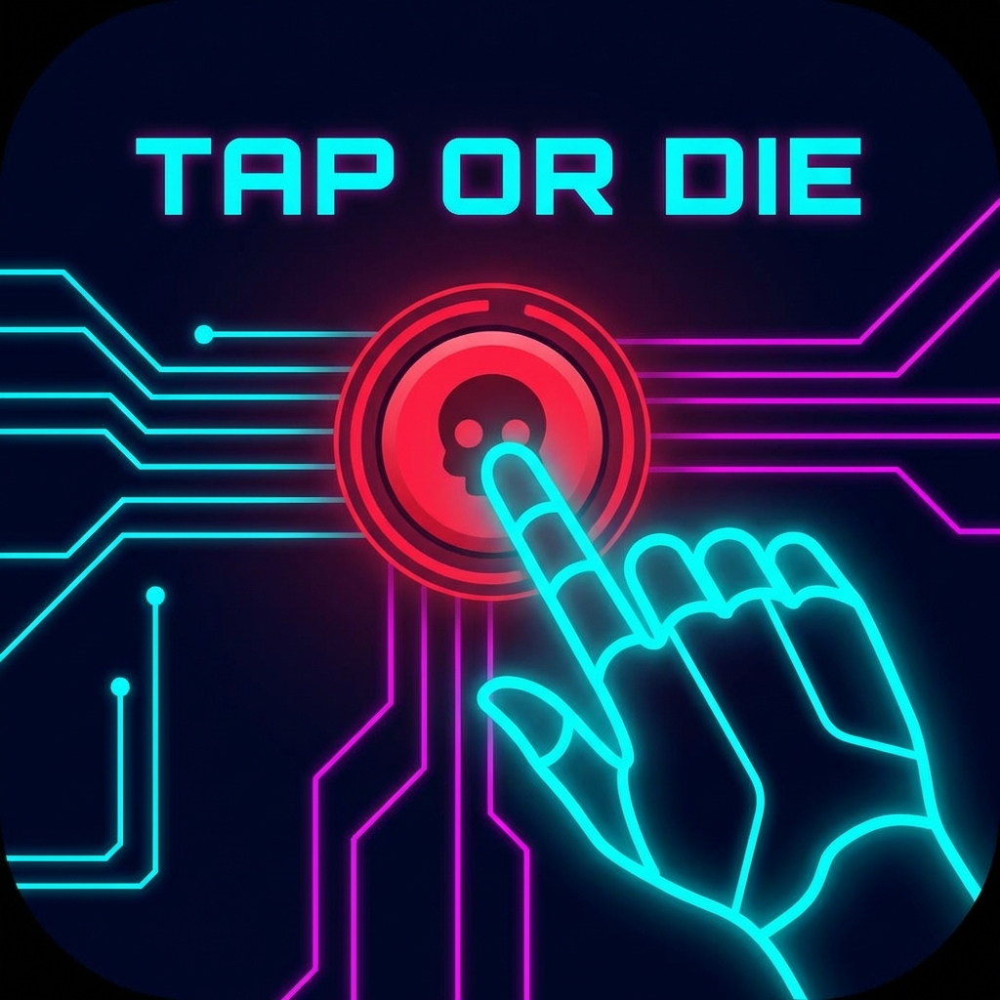

# Tap or Die 🚀
**A high-octane, hyper-casual rhythmic tapping game.**

Built with Vanilla JavaScript and Web Audio API, designed for ultimate performance and responsiveness.

## 🎮 Gameplay Features
- **Infinite Mode**: How long can you survive as tiles shrink faster and faster?
- **Mission Mode**: Complete specific goals (Target counts, Boss kills, Combos) to earn massive rewards.
- **Boss Fights**: Encounter unique bosses like the *Splitter* and *Speed Demon* every 10 levels.
- **Shop & Customization**:
  - **Skins**: 7+ Cyberpunk-themed player skins.
  - **Trails**: Special particle effects (Flame, Electric, Rainbow).
  - **Backgrounds**: Multiple deep-space environments.
- **Power-ups**:
  - 🧲 **Magnet**: Automatically pulls coins to you.
  - ❄️ **Time Freeze**: Slows down the shrinking speed of targets.
  - 💰 **Double Coins**: Maximizes your earnings per hit.

## 🛠️ Tech Stack
- **Engine**: Pure Vanilla JavaScript (ES6+ logic consolidated for compatibility).
- **Audio**: Custom Web Audio API procedural sound engine (melodies evolve with difficulty).
- **Visuals**: CSS3 Animations, HSL-based dynamic color system, and Canvas-free DOM rendering for lightweight performance.
- **Persistence**: `localStorage` based progress tracking.
- **Mobile Ready**: Fully optimized with Service Workers (PWA) and Capacitor-compatible logic.

## 🚀 Getting Started
1. Clone the repository.
2. Open `index.html` in your browser.
   > **Note**: For the best experience (including Audio and Service Workers), use a local server like VS Code "Live Server".

## 📦 Deployment
See [DEPLOYMENT.md](./DEPLOYMENT.md) for instructions on how to build this for Android (Google Play) using Capacitor.
